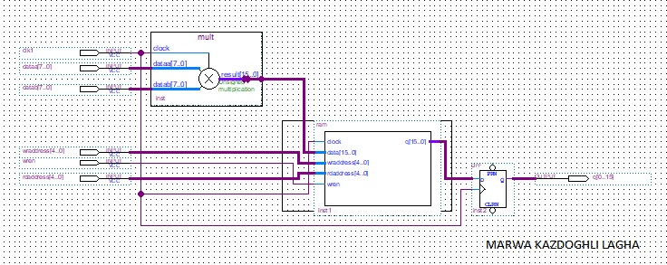
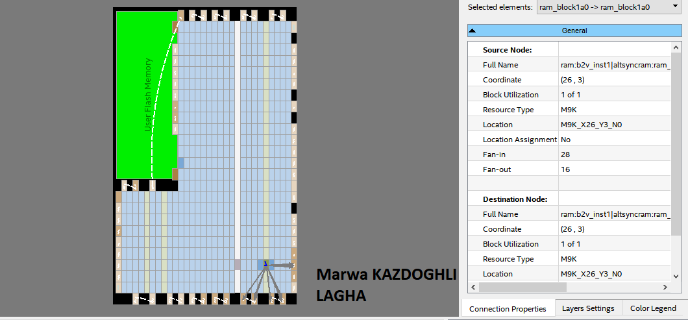
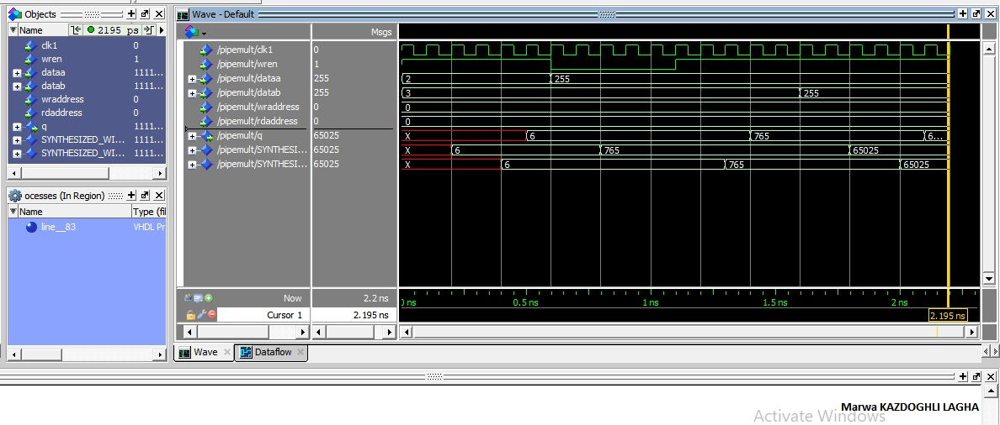

# Create a project in Quartus Prime

## Objective : Create a multiplier and RAM block
🔴 We will see : 
* Pipelined Multiplier Design
* RTL view of the design
* Technology Map view of the design
* Chip planner to view connections to ram subdesign
* Simulate the logic in your FPGA design

## Pipelined Multiplier Design

The figure bellow shows a schematic representation of the top-level design file you will be using today. It consists
of a multiplier and a RAM block. Data is fed to the multiplier from an external source and stored in the
RAM block, which is also controlled externally. The data is then read out of the RAM block by a separate
address control. 

## RTL view of the design

The RTL Viewer allows you to view a logical representation of an analyzed design
graphically. It is a very helpful tool for debugging HDL synthesis results. 

This is a graphical view displaying the logical representation of the design. Currently it shows the I/O, the instantiation of
the mult and ram subdesigns, and an additional set of output registes. Notice the
registers are external to the memory block per the original design.

Note that in the RTL Viewer that the Hierarchy List shows how you can descend
down into the ram subdesign. For each hierarchical level, you can also see the
names of its pins and nets. 

## Technology Map view of the design

The Technology Map Viewer allows you to see how a design is actually implemented
using FPGA/CPLD resources. Use this window as an aid during constraining and
debugging. 

## Chip planner to view connections to ram subdesign

The Chip Planner will give you a sense of where logic has been placed in the design.
This can be very helpful when trying to understand design performance as proximity
is the key to performance in most newer FPGAs and CPLDs. 

You can use the Chip Planner to examine fan-in and fan-out of specific device resources. The
fan-out connections are displayed in grey

## Simulate the logic in your FPGA design

ModelSim is a very powerful tool, this is only an introduction to what it can do for you to help verify the correctness of your design.
It helps to create a Stimulus to drive inputs in the simulation. We'll verify logic design by thoughtful design of test cases applied in the simulation.

## References:

* Wikipedia: https://en.wikipedia.org/wiki/Flip-flop_(electronics)
* Images: https://learnabout-electronics.org ; https://dcaclab.com/
* Course content can be found at Coursera: https://www.coursera.org/learn/fpga-hardware-description-languages
